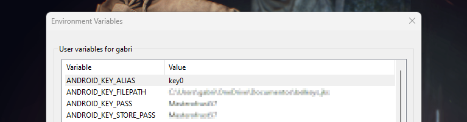

# lotus-emu

An experimental PSXX emulator for Android machines

## Todo

## Setup

### Package's generation

> Some steps needed to be performed before successfully sets-up the project, like configure your sign keys!

- You need to export some environment variables in your base shell!

#### Using your system shell

* Export some variables like:
- ANDROID_KEY_FILEPATH: the full key path for you key (generates one from IDE, if u don't 
has one yet!)
- ANDROID_KEY_ALIAS: alias for you man key
- ANDROID_KEY_PASS: the password for you key
- ANDROID_KEY_STORE_PASS: the password for the store secure key file

#### On Windows
> You should export on your system env variables, these keys: ANDROID_KEY_FILEPATH, ANDROID_KEY_ALIAS, ANDROID_KEY_PASS, ANDROID_KEY_STORE_PASS



#### Using Android Studio as a flatpak package

Issue this command, making the necessary changes
```bash
    sudo flatpak override\
    --env=ANDROID_KEY_FILEPATH=YOUR_KEY_PATH\
    --env=ANDROID_KEY_ALIAS=YOUR_KEY_ALIAS\
    --env=ANDROID_KEY_PASS=YOUR_PASS\
    --env=ANDROID_KEY_STORE_PASS=YOUR_STORE_PASS\
    com.google.AndroidStudio
```
